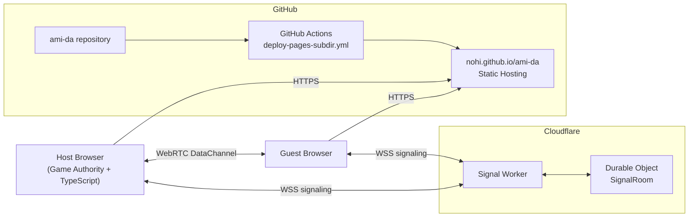
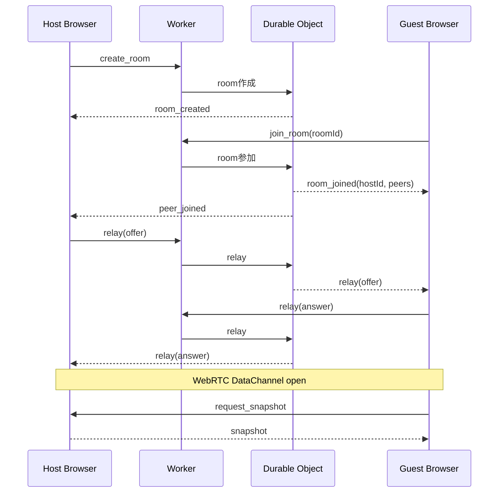
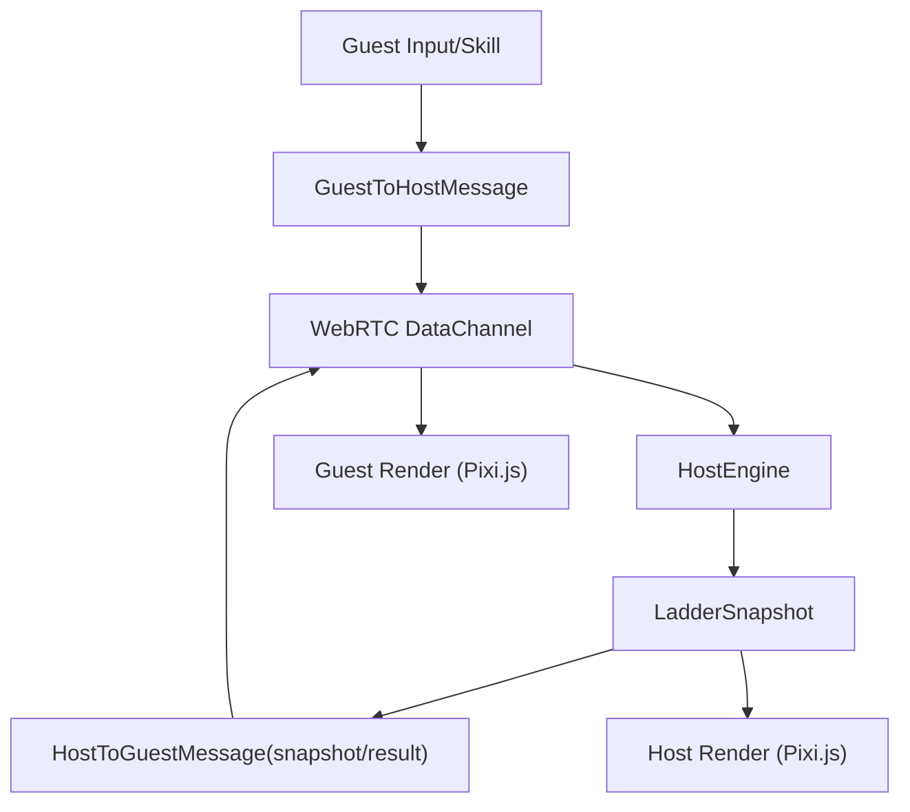

# 干渉あみだくじ アーキテクチャ（Production）

本ドキュメントは、**GitHub Pages + Cloudflare Workers（シグナリング）** を前提とした本番構成をまとめたものです。  
ゲームロジックの権威はホストブラウザが持ち、Cloudflare Workers は WebRTC 接続確立のためのシグナリングを担当します。

## 1. 全体構成

## 2. コンポーネント責務

- `apps/web`（Vite + Pixi.js）
  - UI/描画、入力、ルーム作成/参加、スキル提案送信
  - `StarRtc` が Worker シグナリング経由で WebRTC 接続確立
- `apps/web/src/engine.ts`（ホスト権威）
  - ルール検証、状態更新、スナップショット生成、イベント管理
- `apps/signal`（Cloudflare Worker + Durable Object）
  - ルーム管理、参加通知、SDP/ICE relay
  - ゲーム状態は保持しない（シグナリング専用）

## 3. 実行時シーケンス（作成〜同期）

## 4. データフロー（ゲーム権威）

## 5. デプロイ構成

### Web（GitHub Pages）

- 配信先: `https://nohi.github.io/ami-da/`
- CI: `.github/workflows/deploy-pages-subdir.yml`
- 主要設定:
  - `VITE_BASE_PATH=/ami-da/`
  - `VITE_SIGNAL_URL` は GitHub Secrets から注入

### Signal（Cloudflare Workers）

- 設定: `apps/signal/wrangler.toml`
- Durable Object: `SignalRoom`
- 役割:
  - `create_room`, `join_room`, `relay` のルーティング
  - `peer_joined`/`peer_left` 通知

## 6. 環境変数

### `apps/web/.env`

- `VITE_SIGNAL_URL=wss://<your-worker>.workers.dev`
- `VITE_STUN_URL=stun:stun.l.google.com:19302`
- `VITE_BASE_PATH=/ami-da/`（本番ビルド時はCIで上書き）
- `VITE_DEV_PORT=5173`

## 7. 設計上のポイント

- **ゲーム権威はホストのみ**
  - ゲストは提案送信、最終判定/反映はホスト
- **シグナリングは疎結合**
  - Worker 障害は新規接続に影響、既存 DataChannel 通信は継続可能
- **スケーリング**
  - シグナリングは軽量メッセージ中心で Worker/DO と相性が良い
- **セキュリティ**
  - `wss://` 強制
  - Worker はゲームロジックを持たず、攻撃面を限定
